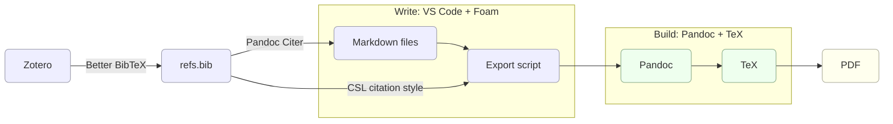

# Thesis in Markdown

This repository is a template for academic writing based on plain text and automatic reference management. I used this setup to research, write, typeset, and produce my economics PhD thesis at Pantheon-Sorbonne University, as well as to prepare slide decks for conferences, notes for classes, and a variety of administrative documents.

- [Thesis in Markdown](#thesis-in-markdown)
  - [Why?](#why)
  - [Quickstart](#quickstart)
  - [Installation](#installation)
    - [TeX](#tex)
    - [Pandoc](#pandoc)
    - [Zotero and Better BibTex](#zotero-and-better-bibtex)
    - [VS Code, Pandoc Citer, and Foam](#vscode-pandoc-citer-and-foam)
    - [Git](#git)
  - [Usage guide](#usage-guide)
    - [Writing](#writing)
    - [Referencing](#referencing)
    - [Cross-referencing](#cross-referencing)
    - [Navigating](#navigating)
    - [Typesetting](#typesetting)
      - [Document class](#document-class)
      - [Customization](#customization)
    - [Exporting](#exporting)
    - [Note-taking with Foam](#note-taking-with-foam)
    - [Version control with Git](#version-control-with-git)
    - [Sync and backup](#sync-and-backup)
  - [Alternatives](#alternatives)

## Why?

I have often seen academic writing workflows in the social sciences rely on proprietary text files (Word or another WYSIWYG editor), references managed by hand, endless versions of the same document, and syncing via Dropbox. In my experience, this works for short projects, but for something long and complex (like a PhD thesis) it quickly becomes unwieldy and error-prone.

This template offers a different path. It is:

* **Simple**: everything is plain text, easy to learn, and free of hidden configuration.
* **Powerful**: references are managed automatically and outputs range from articles to slides to a full dissertation.
* **Flexible**: the setup is minimal by default, but easy to extend, customize, and adapt to your own workflow.

If you share the same frustrations, you're comfortable with a code editor, you can write a bit of LaTeX or command-line, and you enjoy tailoring your tools to your needs, this repository is for you.

## Quickstart

Clone this repository and produce a sample PDF in just a few steps:

1. **Open Terminal** and move into the folder where you want the project:

    ```bash
    cd path/to/my-folder
    ```

2. **Clone this repo**:

    ```bash
    git clone https://github.com/***REMOVED***/thesis-in-markdown.git
    cd thesis-in-markdown
    ```

3. **Install the essentials**:

    - [MacTeX](https://tug.org/mactex/mactex-download.html) (TeX distribution)
    - [Pandoc](https://pandoc.org/installing.html)

    *(You can add Zotero, VS Code, and other tools later. See [Installation](#installation))*

4. **Export a sample document**:

   - Thesis:
     ```bash
     sh export-document.sh examples/thesis
     ```
   - Article:
     ```bash
     sh export-document.sh examples/article.md
     ```
   - Slides:
     ```bash
     sh export-slides.sh examples/slides.md
     ```

   All PDFs will appear in the `exports/` folder.

You now have a working **plain-text → PDF pipeline**. From here you can:

- Edit the sample Markdown files (`thesis/chapters/`, `article/article.md`) and re-export to see changes.
- Proceed with the full [installation](#installation) to enable reference management.
- Check the [Usage guide](#usage-guide) for Markdown, citations, math, diagrams, and more.

## Installation

This setup relies on the following core technologies:

- **Markdown**, the most popular plain text markup format. Markdown is essentially a syntax, so it requires no installation
- **VS Code**, the code editor from Miscrosoft we will use to edit Markdown files. VS Code is free to use, and with plenty of extensions and documentation
- **TeX and Pandoc**, which what will power the interpretation of Markdown files under the hood to produce beautiful documents
- **Zotero**, a full-fledged open-source reference management solution. We will connect it to VS Code to access our references directly in the text editor and automatically generate reference sections
- **Foam**, a VS Code extension to create a knowledge base
- **Git**, the standard solution for version control

Together, these tools form a simple pipeline: you write in Markdown, build with Pandoc and TeX, manage references with Zotero, and produce PDFs.



---

The following instructions are for macOS, but the same software is available for Linux and Windows.

### TeX

[TeX](https://en.wikipedia.org/wiki/TeX) is a typesetting program. You may be familiar with LaTeX, a set of macros for TeX. We need to install a TeX distribution, which will include LaTeX among other tools. For macOS, you can [install MacTeX](https://tug.org/mactex/mactex-download.html).

### Pandoc 

[Pandoc](https://pandoc.org/) can convert text files between formats (think HTML, LaTeX, docx...). We will use it to produce beautiful PDFs from our Markdown input, using TeX under the hood. TeX and Pandoc rely primarily on a command-line interface (CLI), but graphical user interfaces (GUI) also exist.

The Pandoc installer can be downloaded [here](https://pandoc.org/installing.html).

### Zotero and Better BibTex

This setup relies on [Zotero](https://www.zotero.org/), a full-fledged and open-source reference manager. Zotero helps you **collect and organize articles, books, and a variety of sources**. We will also use it to automatically format references and bibliographies in our documents. Zotero can be downloaded [here](https://www.zotero.org/download/).

---

For our system to work, **we need the `refs.bib` file to stay synchronized with our Zotero collection**. For that we will use a Zotero extension called Better BibTeX.

- Follow the [installation instructions for Better BibTex](https://retorque.re/zotero-better-bibtex/installation/).

- Next, you have to tell Better BibTeX to synchronize your collection with the `refs.bib` file in this project. Say you have a `research` or `thesis` folder in Zotero, where you collect all material relevant to your dissertation. Follow the instructions for [automatic export](https://retorque.re/zotero-better-bibtex/exporting/auto/):

  > ... right-click on it in the left Zotero pane and choose "Export Library…" or "Export Collection...". With Better BibTeX's export translators (e.g., "Better BibTeX"), checking the Keep updated option will register the export for automation.

- To **quickly find references from our text editor**, we will type in **Citation Keys** (as we will see in [Referencing](#referencing)). Citation Keys are unique identifiers automatically given to each item by Better BibTeX. In the Better BibTeX settings, enter your preferred citation key formula. I use: `authEtAl+origyear+":"+shorttitle(3,3)+postfix("-%(n)s")`. That way, Alfred Chandler's 1962 book *Strategy and Structure: Chapters in the History of the Industrial Enterprise* will have `Chandler1962:StrategyStructureChapters`as a citation key.

Another useful extension is a [connector for your browser](https://www.zotero.org/download/connectors) to **add items into your Zotero collector directly from the internet**.

### VS Code, Pandoc Citer, and Foam

Next, we need a text editor to write Markdown, pull references from our `refs.bib` file, and navigate our project. **This setup uses Visual Studio Code, or VS Code for short**. VS Code is a popular text editor for software development. You can [download it here](https://code.visualstudio.com/download). For a Free/Libre version of Microsoft's software, you can alternatively use [VSCodium](https://vscodium.com/), although I haven't tested the setup with it.

---

For the setup to work, **we need a few VS Code extensions**. To find and manage extensions in VS Code, first open the Command Palette with `Cmd-Shift-P`, then start typing "extension" until the command `Extensions: Install Extensions` appears. Press Enter.

- The only strictly necessary extension to this setup is **[Pandoc Citer](https://marketplace.visualstudio.com/items?itemName=notZaki.pandocciter), which will allow us to find references while typing**. Once installed, Pandoc Citer must be configured to target `refs.bib`. The "Default Bibs" setting is already configured in this project, but you can edit it in `.vscode/settings.json`. `.vscode` is a hidden folder which VS Code uses to edit settings for this particular workspace.

- The setup also relies on **[Foam](https://foambubble.github.io/)** for **building a knowledge base**, although you may want to ignore it if you already have a solution. I like having my notes readily accessible when I'm writing, and I don't like giving too much thought to structuring my knowledge base as I'm researching a topic. Foam is great on both fronts. The minimal install only requires the [Foam VS Code extension](https://marketplace.visualstudio.com/items?itemName=foam.foam-vscode), but you can also follow the [instructions](https://foambubble.github.io/foam/#getting-started) for more features.

I also recommend installing **extensions for comfortably writing Markdown**, like [Markdown All In One](https://marketplace.visualstudio.com/items?itemName=yzhang.markdown-all-in-one) or [Marky Markdown](https://marketplace.visualstudio.com/items?itemName=robole.marky-markdown). There are many other extentions for you to try out and make VS Code your own.

### Git

Git is a versioning tool. It allows you to **document every step of the writing processes, go back in time to a previous version of a document**, and much more. Git should be installed on your machine by default. You can check this by typing `git --version` in the Terminal.app on macOS. Otherwise, follow the [intallation instructions](https://git-scm.com/downloads/mac).

Git is not necessary for the setup to work, and requires some getting used to. I've found that using Git to document every step of the work has made me more consistent and focused. See below for a [minimal usage guide](#version-control-with-git).

## Usage guide

This section walks through the essentials of working with this template:

* [Writing](#writing) in Markdown, explained by example
* [Referencing](#referencing) and [cross-referencing](#cross-referencing)
* Using VS Code tools for [navigation](#navigating) and building a knowledge base for [research](#researching)
* [Typesetting](#typesetting) the documents for customization
* [Exporting](#exporting) outputs, from simple notes and slides to a full thesis.
* Managing your project with [version control](#version-control) and setting up [sync and backup](#sync-and-backup) to protect your work

### Writing 

The specific flavor of Markdown used is [Pandoc Markdown](https://pandoc.org/MANUAL.html). To get started, have a look at [`examples/article.md`](examples/article.md). This file shows:

- Markdown basics (headings, bold/italic, block quotes)  
- Mathematical expressions
- Images with captions
- Diagrams as images or Mermaid charts
- Footnotes
- Examples of [referencing](#referencing) and [typesetting](#typesetting) discussed below.

You can view the formatted Markdown by exporting it as PDF with the command from the [Quickstart](#quickstart) section. (You can also preview the file in VS Code with the command `Markdown: Open Preview`, although some advanced feature of the setup won't work.)

### Referencing

To **reference**, simply type `@` and part of a `@citationKey` you are looking for and select it in the drop-down.

<!-- GIF -->

The `Pandoc Citer` VS Code extension will provide autocomplete based on the contents of the `refs.bib` file, which is automatically updated by Zotero's `Better BibTex` extension.

The output of references is determined by the Citation Style Language (CSL) citation style at the root of the project. The style included in this repository is the [Chicago Manual of Style 17th edition (author-date)](./citation-style-CMS17.csl), but you can choose [another CSL style](https://github.com/citation-style-language/styles?tab=readme-ov-file).

The formatting options for citations cover many situations:

| Markdown input                             | Output (CMS17)                    |
| ------------------------------------------ | --------------------------------- |
| `@Lucas1986`                               | Lucas (1986)                      |
| `-@Lucas1986`                              | (1986)                            |
| `[@Lucas1986; @Lucas 2001]`                | (Lucas 1986; 2001)                |
| `Robert Lucas [-@Lucas1986; -@Lucas 2001]` | Robert Lucas (1986; 2001)         |
| `[@Lucas1986 41]`                          | (Lucas 1986, 41)                  |
| `Robert Lucas [-@Lucas1986 41]`            | Robert Lucas (1986, 41)           |
| `[see also in @Lucas1986 41]`              | (see also in Lucas 1986, 41)      |
| `[@Lucas1986 41 43]`                       | (Lucas 1986, 41, 43)              |
| `[@Lucas1986 41-43]`                       | (Lucas 1986, 41-43)               |
| `[@Lucas1986, @GlaeserEtAl1992]`           | (Lucas 1986; Glaeser et al. 1992) |

### Cross-referencing

Cross-referencing means creating links inside your own document, as when pointing readers to a figure, table, equation, or section. In this setup, we use **LaTeX syntax**. The basic idea is:

1. **Define a label** where the object is introduced (a figure, table, section, or equation).

   ```latex
   \label{fig:my-diagram}
   ```

2. **Refer to that label** later in the text:

   ```latex
   see Figure~\ref{fig:my-diagram}
   ```

Pandoc + TeX will replace the label with the correct number, keeping everything updated automatically if you add, remove, or reorder content. See [`examples/article.md`](examples/article.md) for a working example.

### Navigating

VS Code offers plenty of built-in navigation tools which become increasingly useful as files grow in size and multiply. Here are a few of the [many shortcuts](https://code.visualstudio.com/docs/configure/keybindings) available in VS Code.

- `Cmd+Shift+O` to navigate to a heading of the current markdown document
- `Cmd+P` to navigate to a different file within the project
- `ctrl+-` sends the cursor to its last position

<!-- GIF navigating to a heading and to a file -->

- `Cmd+Shift+P` to open the Command Palette. This is where you can access the functionalities of most extentions.

<!-- GIF with an action -->

- `Cmd+F` for a search (and replace) in the current file; if text is selected, the same text will be inserted in the search bar
- `Cmd+option+F` same as above, but expands the search bar to search and replace
- `Cmd+Shift+F` for a search (and replace) across all files in the project

<!-- GIF search and replace -->

- To move a paragraph up or down, place the cursor within the paragraph and respectively use `option+Up` or `option+Down`.
- To duplicate a paragraph up or down, place the cursor within the paragraph and respectively use `option+Shift+Up` or `option+Shift+Down`.
- To insert multiple cursors, either maintain `option` pressed while clicking on each poitn where you want to isnert a cursor, or press `option+Cmd+Up`/`option+Cmd+Down` to multiply cursors on multiple lines.

<!-- GIF of multiple cursors -->

- `option+Shift+A` comments out the selected text or inserts an inline comment if no text is selected
- `Cmd+Shift+A` comments out the paragraph where the cursor is located or inserts a comment as a paragraph

### Typesetting

When you pass Markdown file to Pandoc, it translates it into LaTeX before producing a PDF. To format the document, Pandoc first applies **the `documentclass`**, then applies any extra typesetting instructions with **specified custom parameters**.

#### Document class

- **Article class**: If you don't specify a `documentclass`, Pandoc will use the `article` LaTeX class. This is the case in [`examples/article.md`](./examples/article.md).

- **Memoir class** is an alternative to the `book` class for long documents. See [`examples/thesis/`](./examples/thesis/) for a working configuration.

- **Beamer class** is used to produce slides. Rather than being specified in [`examples/slides.md`](./examples/slides.md), the class is applied in the [`export-slides.sh`](./export-slides.sh) script.

#### Customization

Any extra typesetting arguments we pass to Pandoc will overwrite the corresponding parameters in the chosen document class in the following ways:

- Either as parameters in the **front matter**, a section at the beginning of Markdown documents formatted in [YAML](https://yaml.org/)

  - The YAML front matter may contain the title, author and date metadata; an abstract; LaTeX packages (`\usepackage{...}`); page geometry, margins, line spacing; and custom commands (`\newcommand{}`).
  - See the beginning of [`examples/article.md`](./examples/article.md) for an example with the `article` class.
  - See the thesis example and consult the [Memoir manual](https://ctan.org/pkg/memoir) for further customization of the Memoir class.

- And/or as **LaTeX commands** in the body of the Markdown document (see [`examples/thesis/0_frontmatter.md`](./examples/thesis/0_frontmatter.md) for an example)

- **For slides**, you can customize look and feel in `beamer-template.tex` and `beamer-style.tex`.

Finally, the **back matter** is where Pandoc inserts automatically generated content at the end of your thesis: References (from `refs.bib` + CSL style), List of figures, List of tables, Table of Contents… See the examples for a working configuration.

### Exporting

Pandoc takes your Markdown, applies layout from the **front matter** (extra metadata and LaTeX settings at the top of your document, see for example `examples/article.md`), formats `@citationKeys` with **`refs.bib`** and your **CSL style**, inserts a **References** list when needed, and produces a **PDF** (or slides).

Here are the export scripts you already tried in the [Quickstart](#quickstart):

- **`export-document.sh`** for articles, notes, and long documents

  - Accepts either a single `.md` file or a directory of `.md` files
  - If given a directory, it concatenates files in **alphabetical order**
  - Feeds the `refs.bib` to the citation engine with the `--citeproc` flag
  - Uses the `citation-style-CMS17.csl` to format citations (to **change citation style**, swap out `citation-style-CMS17.csl` in the export scripts if you need APA, MLA, etc.)

- **`export-slides.sh`** for Beamer slide decks

  - Applies the `beamer` class with the `-t beamer` argument
  - Uses `beamer-template.tex` (document skeleton) and `beamer-style.tex` (theme and macros)
  - Follows the same citation pipeline (`--citeproc`, `refs.bib`, CSL)

---

*Note in the [Installation](#installation) diagram that `refs.bib` is used twice: (1) by VS Code in `.vscode/settings.json` (Pandoc Citer for autocomplete) and (2) by Pandoc itself in the export scripts (for formatting at build time).*

---

Markdown can also be **exported directly to HTML or PDF**, without Pandoc (for example with the VS Code extension *Markdown All in One* command `Print current document to HTML`). But this has limitations:

- Pandoc’s extended Markdown features are unavailable
- `@citationKeys` will not resolve into references
- LaTeX commands and packages may not be processed

### Note-taking with Foam

This setup doesn't dictate how you manage your notes, but it works well with [Foam](https://foambubble.github.io/), a VS Code extension for building a personal wiki.

For details, see [the related Foam note in the wiki](wiki/using-foam.md).

### Version control with Git

Git lets you "save snapshots" of your work so you can track progress, tag milestones, and roll back if needed. You only need to know the basics to get started:

1. **Stage your changes** (the files you've edited):

    ```bash
    git add .
    ```

2. **Commit them with a message**:

    ```bash
    git commit -m "Draft intro chapter"
    ```

3. **Tag important versions** (like a submission draft):

    ```bash
    git tag draft1
    ```

That's enough for everyday use. The key is to **commit regularly** so your writing is backed by a version history, and to **stage changes in small, related chunks** that reflect a single task. Over time you can also:

- Browse history and "time travel" to older versions
- Sync your repo with GitHub or another remote
- Learn branching for experiments

See the [official Git docs](https://git-scm.com/docs) for more.

### Sync and backup

It's an all too common tragedy: a doctoral student loses months (or years) of work to a failed hard drive or a stolen laptop. Don't let that be you.

There are **two complementary protections**:

- **Sync**: keeps your files up to date across devices. Examples include Zotero sync, GitHub, Dropbox, Syncthing, and Synology solutions. You may prevent data loss in the case of a lost device, but **if something gets corrupted or deleted, the bad copy is synced too**

- **Backups** take point-in-time snapshots that you can restore later. They are used to recover a clean copy after mistakes, crashes, or sync errors. Examples include Time Machine (macOS), Borg, and Synology Hyper Backup. Best practice: back up both your **Zotero library folder** and your **writing project folder**

If you only do the basics, do this:

- Turn on Zotero sync (keeps your references and PDFs safe).
- Use GitHub (private repo) or Dropbox to sync your thesis project folder.
- Run Time Machine (macOS) or an equivalent backup tool so you can restore your system to any previous state.

## Alternatives

This template sits between raw LaTeX (powerful but heavy) and tools like Obsidian/Zettlr (nice UI but less transparent). It's opinionated but flexible.

There are many **alternative solutions** for plain-text academic writing, which rely similar technologies but with varying levels of integration, flexibility, and streamlining.

- For an editor-agnostic solution, see https://github.com/tompollard/phd_thesis_markdown
- Pure LaTeX or ANSIIdoc as an alternative for Markdown
- Obsidian, Zettlr, Loqseq, Scrivener