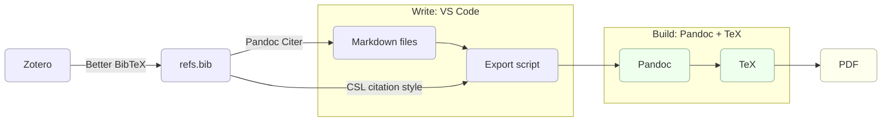

# Academic Writing in Markdown

This repository is a template for academic writing based on plain text and automatic reference management. I used this setup to research, write, typeset, and produce my economics PhD dissertation at Pantheon-Sorbonne University, as well as to prepare slide decks for conferences, notes for classes, and a variety of administrative documents.

- [Academic Writing in Markdown](#academic-writing-in-markdown)
  - [Why?](#why)
  - [Quickstart](#quickstart)
  - [Installation](#installation)
    - [TeX](#tex)
    - [Pandoc](#pandoc)
    - [Zotero and Better BibTeX](#zotero-and-better-bibtex)
    - [VS Code and Pandoc Citer](#vscode-and-pandoc-citer)
    - [Git](#git)
  - [Usage guide](#usage-guide)
    - [Editing Markdown files](#editing-markdown-files)
    - [Navigating in VS Code](#navigating-in-vscode)
    - [Typesetting your documents](#typesetting-your-documents)
    - [Exporting your documents](#exporting-your-documents)
    - [Version control with Git](#version-control-with-git)
    - [Sync and backup](#sync-and-backup)

<!-- The Table of Contents above is generated and auto-updated by the Markdown All In One extension in VS Code. (This block is a comment. You can only see it in the source Markdown code.) -->

## Why?

I have often seen academic writing workflows in the social sciences rely on proprietary text files (Word or another [WYSIWYG](https://en.wikipedia.org/wiki/WYSIWYG) editor), references managed by hand, endless versions of the same document, and syncing via Dropbox. In my experience, this works for short projects, but for something long and complex (like a PhD dissertation) it quickly becomes unwieldy and error-prone.

This template offers a different path. Although the effort upfront is higher than opening Word and going from there, in the long run this tempalte proves to be:

- **simple**, as everything is plain text and easy to learn;
- **flexible**, easy to extend, customize, and adapt to your own workflow;
- **powerful**, with citations managed automatically and easy navigation in large projects.

If you share the same frustrations, you're comfortable with a code editor, you can write a bit of LaTeX or command-line, and you enjoy tailoring your tools to your needs, this repository is for you.

## Quickstart

Clone this repository and produce a sample PDF in just a few steps:

1. **Open Terminal** and move into the folder where you want the project:

    ```bash
    cd path/to/my-folder
    ```

2. **Clone this repo**:

    ```bash
    git clone https://github.com/cedricphdivry/academic-writing-markdown
    cd academic-writing-markdown
    ```

3. **Install the essentials**:

    - [MacTeX](https://tug.org/mactex/mactex-download.html) (TeX distribution)
    - [Pandoc](https://pandoc.org/installing.html)

    *(You can add Zotero, VS Code, and other tools later. See [Installation](#installation))*

4. **Export a sample document**:

   - Singe-file document (e.g. an article):
     ```bash
     sh export-document.sh examples/cookbook.md
     ```
   - Multi-file document (e.g. a dissertation):
     ```bash
     sh export-document.sh examples/dissertation
     ```
   - Slides:
     ```bash
     sh export-slides.sh examples/slides.md
     ```

   All PDFs will appear in the `exports/` folder.

You now have a working **plain-text → PDF pipeline**. From here you can:

- Edit the sample Markdown files (`dissertation/chapters/`, `examples/cookbook.md`) and re-export to see changes
- Proceed with the full [installation](#installation) to enable reference management
- Check the [usage guide](#usage-guide) for Markdown, citations, math, diagrams, and more

## Installation

This setup relies on the following core technologies:

- **Markdown**, a popular and simple plain text markup format (requires no installation because it is essentially a syntax)
- **TeX and Pandoc**, which what will power the interpretation of Markdown files under the hood to produce beautiful documents
- **VS Code**, or Visual Studio Code, the code editor from Microsoft we will use to edit Markdown files
- **Zotero**, a full-fledged open-source reference management solution which can be connected to our workflow using extensions (Better BibTeX for Zotero and Pandoc Citer for VS Code)
- **Git**, the standard solution for version control

Together, these tools form a simple pipeline: you write in Markdown, build with Pandoc and TeX, manage references with Zotero, and produce PDFs.



The following instructions are for macOS, but the same software is available for Linux and Windows.

---

*Note: This README is the only document of this repository which is intended to be rendered by GitHub's engine on the repository page rather than by the Pandoc pipeline.*

### TeX

[TeX](https://en.wikipedia.org/wiki/TeX) is a typesetting program. You may be familiar with LaTeX, a set of macros for TeX. We need to install a TeX distribution, which will include LaTeX among other tools.

→ For macOS, you can [install MacTeX](https://tug.org/mactex/mactex-download.html).

### Pandoc 

[Pandoc](https://pandoc.org/) can convert text files between formats (think HTML, LaTeX, docx...). We will use it to produce beautiful PDFs from our Markdown input, using TeX under the hood. TeX and Pandoc rely primarily on a command-line interface (CLI), but graphical user interfaces (GUI) also exist.

→ The Pandoc installer can be downloaded [here](https://pandoc.org/installing.html).

### Zotero and Better BibTeX

This setup relies on [Zotero](https://www.zotero.org/), a full-fledged and open-source reference manager. Zotero helps you **collect and organize articles, books, and a variety of sources**. We will also use it to automatically format references and bibliographies in our documents. 

→ Zotero can be downloaded [here](https://www.zotero.org/download/).

For our system to work, we need the `refs.bib` file to stay synchronized with our Zotero collection. For that we will use a Zotero extension called **Better BibTeX**.

→ Follow the [installation instructions for Better BibTex](https://retorque.re/zotero-better-bibtex/installation/).

Next, we need to tell Better BibTeX to synchronize the Zotero collection with the `refs.bib` file in this project. Say you have a `research` folder in Zotero, where you collect all material relevant to your dissertation.

→ Follow the instructions for [automatic export](https://retorque.re/zotero-better-bibtex/exporting/auto/). Right click on your `research` folder,

> ... and choose "Export Library…" or "Export Collection...". With Better BibTeX's export translators (e.g., "Better BibTeX"), checking the Keep updated option will register the export for automation.

To quickly find references from our text editor, we will type in **Citation Keys** (see examples in [the cookbook](./examples/cookbook.md#citations-requires-pandoc)). Citation Keys are unique identifiers automatically given to each item in our collection by Better BibTeX. 
 
→ In the Better BibTeX settings, **enter your preferred citation key formula**. I use: `authEtAl+origyear+":"+shorttitle(3,3)+postfix("-%(n)s")`. That way, Alfred Chandler's 1962 book *Strategy and Structure: Chapters in the History of the Industrial Enterprise* will have `Chandler1962:StrategyStructureChapters`as a citation key.

*Note: Another useful extension is a [connector for your browser](https://www.zotero.org/download/connectors) to add items into your Zotero collector directly from the internet.*

### VS Code and Pandoc Citer

Next, we need a text editor to write Markdown, pull references from our `refs.bib` file, and navigate our project. **This setup uses [Visual Studio Code](https://code.visualstudio.com/), or VS Code for short**. VS Code is a popular text editor for software development. 

→ You can [download VS Code here](https://code.visualstudio.com/download). For a Free/Libre version of Microsoft's software, you can alternatively use [VSCodium](https://vscodium.com/), although I haven't tested the setup with it.

For the setup to work, **we need to install a VS Code extension**. To find and manage extensions in VS Code, first open the Command Palette with `Cmd-Shift-P`, then start typing "extension" until the command `Extensions: Install Extensions` appears. Press Enter.

- The only strictly necessary extension to this setup is **[Pandoc Citer](https://marketplace.visualstudio.com/items?itemName=notZaki.pandocciter), which will allow us to find references while typing**. Once installed, Pandoc Citer must be configured to target `refs.bib`. The "Default Bibs" setting is already configured in this project, but you can edit it in `.vscode/settings.json`. `.vscode` is a hidden folder which VS Code uses to edit settings for this particular workspace.

I also recommend installing **extensions for comfortably writing Markdown**, like [Markdown All In One](https://marketplace.visualstudio.com/items?itemName=yzhang.markdown-all-in-one) or [Marky Markdown](https://marketplace.visualstudio.com/items?itemName=robole.marky-markdown). There are [many other extentions](https://marketplace.visualstudio.com/VSCode) for you to try out and make VS Code your own.

### Git

Git is a versioning tool. It allows you to **document every step of the writing processes, go back in time to a previous version of a document**, and much more. 

→ Git should be installed on your machine by default. You can check this by typing `git --version` in the Terminal.app on macOS. Otherwise, follow the [installation instructions](https://git-scm.com/downloads/mac).

Git is not necessary for the setup to work, and requires some getting used to. I've found that using Git to document every step of the work has made me more consistent and focused. See below for a [minimal usage guide](#version-control-with-git).

## Usage guide

This section walks through the essentials of working with this template:

- [Editing Markdown files](#editing-markdown-files), by example
- [Navigating](#navigating-in-vscode) your project with VS Code commands and keyboard shortcuts
- [Typesetting](#typesetting-your-documents) with YAML parameters and LaTeX commands
- [Exporting PDF files](#exporting-your-documents), from simple notes and slides to a full dissertation
- Managing your project with [version control](#version-control) and setting up [sync and backup](#sync-and-backup) to protect your work

### Editing Markdown files

To get started, have a look at the [`examples/cookbook.md`](examples/cookbook.md) file that you exported in the [Quickstart](#quickstart).

This file demonstrates [Markdown basics](examples/cookbook.md#basic-syntax)  (headings, bold/italic, block quotes...); [mathematical expressions](examples/cookbook.md#math) in LaTeX; [images](examples/cookbook.md#images) and [tables](examples/cookbook.md#tables) with captions; and advanced features which require Pandoc to function: [footnotes](examples/cookbook.md#footnotes-requires-pandoc), [citations](examples/cookbook.md#citations-requires-pandoc), [cross-referencing](examples/cookbook.md#cross-referencing-requires-pandoc), [bibliography generation](examples/cookbook.md#bibliography-requires-pandoc), and [LoT/LoF](examples/cookbook.md#lot-and-lof-requires-pandoc).

### Navigating in VS Code

Out of the box, VS Code provides [many tools](https://code.visualstudio.com/Docs/languages/markdown) to improve the writing experience in Markdown. Below are some of the shortcuts which become increasingly useful as files grow in size and multiply:

- **Executing commands**
  - `Cmd+Shift+P` to open the **Command Palette**. This is where you can access the functionalities of most extentions.
  - For example, open the command palette, start typing "extensions," and press `Enter` when the command `Extensions: Install Extensions` is selected.

- **Editing text**
  - To move a paragraph up or down, place the cursor within the paragraph and respectively use `option+Up` or `option+Down`.
  - To duplicate a paragraph above or below, place the cursor within the paragraph and respectively use `option+Shift+Up` or `option+Shift+Down`.
  - To insert multiple cursors, either maintain `option` pressed while clicking on each point where you want to insert a cursor, or press `option+Cmd+Up`/`option+Cmd+Down` to multiply cursors across lines. Press `Escape` to collapse multiple cursors.
  - `option+Shift+A` comments out the selected text or inserts an inline comment if no text is selected
  - `Cmd+Shift+A` comments out the paragraph where the cursor is located or inserts a comment as a paragraph

- **Search and replace**
  - `Cmd+F` for a search (and replace) in the current file; if text is selected, the same text will be inserted in the search bar
  - `Cmd+option+F` same as above, but expands the search bar to search and replace
  - `Cmd+Shift+F` for a search (and replace) across all files in the project

- **Navigating the document**
  - `Cmd+Shift+O` to navigate to a heading of the current markdown document
  - `Cmd+Up`/`Cmd+Down` to move the cursor to the beginning/end of the document
  - `ctrl+-` sends the cursor to its last position (useful if you press `Cmd+Up`/`Cmd+Down` by mistake!)

- **Navigating the project**
  - `Cmd+P` to navigate to a different file within the project
  - `Cmd+Shift+E` to view the file explorer

### Typesetting your documents

When you pass Markdown file to Pandoc, it translates it into LaTeX before producing a PDF. Document formatting happens in two steps:

1. Pandoc first applies **the `documentclass`** setting;
2. it applies any extra typesetting instructions in the **front matter**, which overwrite the corresponding parameters of the `documentclass`;
3. finally, it applies any **LaTeX commands** relating to page layout and typesetting found throughout the document

Changing the look and feel out output documents involves intervening in those two steps.

1. **Change the `documentclass`**

    - The **article class** is the default `documentclass` applied by Pandoc, as in [`examples/cookbook.md`](examples/cookbook.md). See the [article class documentation](https://ctan.org/pkg/article).
    - The **memoir class** is an alternative to the `book` class for long documents. Notice in [`examples/dissertation/0_frontmatter.md`](./examples/dissertation/0_frontmatter.md), the `documentclass` field is set to `memoir`. See the [memoir class manual](https://ctan.org/pkg/memoir).
    - The **beamer class** is used to produce slide decks. Rather than being specified in [`examples/slides.md`](./examples/slides.md), the class is applied in the [`export-slides.sh`](export-slides.sh) script. See the beamer [reading list](./examples/slides.md#further-reading) in the slides.

2. **Modify the frontmatter**

    - The frontmatter usually refers to section at the beginning of Markdown documents formatted in [YAML](https://yaml.org/) (see the [cookbook](examples/cookbook.md) and [slides](./examples/slides.md) for examples)
    - The YAML front matter may contain the `documentclass`, the title, author and date metadata, an abstract, page geometry, margins, line spacing, LaTeX packages (`\usepackage{}`), custom commands (`\newcommand{}`), etc. See the [full list of variables](https://pandoc.org/MANUAL.html#variables) supported by Pandoc in the YAML front matter.

3. **Apply LaTeX commands**

    - LaTeX commands throughout the body of the Markdown document may control typesetting, page layout, etc.
    - See [`examples/dissertation/0_frontmatter.md`](./examples/dissertation/0_frontmatter.md) for an example
    - Note that Pandoc cannot translate Markdown syntax and citation keys within LaTeX commands. See the beginning [`examples/dissertation/1_chapter1.md`](examples/dissertation/1_chapter1.md).
  
### Exporting your documents

Pandoc takes your Markdown, applies layout from the **front matter** (`documentclass` and YAML variables) and LaTeX commands, formats `@citationKeys` with **`refs.bib`** and your **CSL style** (see the [citations section](./examples/cookbook.md#citations-requires-pandoc) of the cookbook), and produces a **PDF** (or other formats, such as `.docx`, `.html`, [and more](https://pandoc.org/MANUAL.html#options)).

Here are the export scripts you already tried in the [Quickstart](#quickstart):

- **`export-document.sh`** for articles, notes, and long documents

  - Accepts either a single `.md` file or a directory of `.md` files
  - If given a directory, it concatenates files in **alphabetical order**
  - Feeds the `refs.bib` to the citation engine with the `--citeproc` flag
  - Uses the `citation-style-CMS17.csl` to format citations (to **change citation style**, swap out `citation-style-CMS17.csl` in the export scripts if you need APA, MLA, etc.)

- **`export-slides.sh`** for Beamer slide decks

  - Applies the `beamer` class with the `-t beamer` argument
  - Follows the same citation pipeline (`--citeproc`, `refs.bib`, CSL)

---

*Note: in the [Installation](#installation) diagram, `refs.bib` is used twice: (1) by VS Code in `.vscode/settings.json` (Pandoc Citer for autocomplete) and (2) by Pandoc itself in the export scripts (for formatting at build time).*

---

Markdown can also be exported directly to HTML or PDF, **without Pandoc** (for example with the VS Code extension *Markdown All in One* command `Print current document to HTML`). But this has limitations: Pandoc's extended Markdown features are unavailable, `@citationKeys` will not resolve into references, and LaTeX commands and packages may not be processed.

### Version control with Git

Git lets you "save snapshots" of your work so you can track progress, tag milestones, and roll back if needed. You only need to know the basics to get started:

1. **Stage your changes** (the files you've edited):

    ```bash
    git add .
    ```

2. **Commit them with a message**:

    ```bash
    git commit -m "Draft intro chapter"
    ```

3. **Tag important versions** (like a submission draft):

    ```bash
    git tag draft1
    ```

4. **View commit history**

    ```bash
    git log
    ```

That's enough for everyday use. The key is to **commit regularly** so your writing is backed by a version history, and to **stage changes in small, related chunks** that reflect a single task. Over time you can also:

- "Time travel" to older versions
- Sync your repo remote repository (e.g. GitHub)
- Learn branching for experiments, etc.

See the [official Git docs](https://git-scm.com/docs) for more.

### Sync and backup

It's an all too common tragedy: a researcher loses months (or years) of work to a failed hard drive or a stolen laptop. Don't let that be you.

There are **two complementary protections**:

- **Sync**: keeps your files up to date across devices. Examples include [Zotero sync](https://www.zotero.org/support/sync), GitHub, Dropbox, [Syncthing](https://syncthing.net/), and Synology solutions. You may prevent data loss in the case of a lost device, but **if something gets corrupted or deleted, the bad copy is synced too**

- **Backups** take point-in-time snapshots that you can restore later. They are used to recover a clean copy after mistakes, crashes, or sync errors. Examples include Time Machine (macOS), Borg, and Synology Hyper Backup.

If you only do the basics, I recommend combining these three measures:

1. Turn on Zotero sync (keeps your references and PDFs safe).
2. Use GitHub (private repo) or Dropbox to sync your dissertation project folder.
3. Run Time Machine (macOS) or an equivalent backup tool so you can restore your system to any previous state.