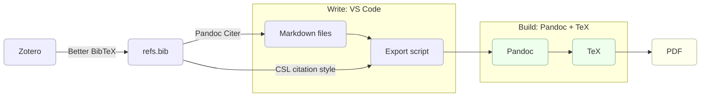

# Installation

This setup relies on the following core technologies:

- **Markdown**, a popular and simple plain text markup format (requires no installation because it is essentially a syntax)
- **TeX and Pandoc**, which what will power the interpretation of Markdown files under the hood to produce beautiful documents
- **VS Code**, or Visual Studio Code, the code editor from Microsoft we will use to edit Markdown files
- **Zotero**, a full-fledged open-source reference management solution which can be connected to our workflow using extensions (Better BibTeX for Zotero and Pandoc Citer for VS Code)
- **Git**, the standard solution for version control

Together, these tools form a simple pipeline: you write in Markdown, build with Pandoc and TeX, manage references with Zotero, and produce PDFs.

The following instructions are for macOS, but the same software is available for Linux and Windows.

---

*Note: This README is the only document of this repository which is intended to be rendered by GitHub's engine on the repository page rather than by the Pandoc pipeline.*

## TeX

[TeX](https://en.wikipedia.org/wiki/TeX) is a typesetting program. You may be familiar with LaTeX, a set of macros for TeX. We need to install a TeX distribution, which will include LaTeX among other tools.

→ For macOS, you can [install MacTeX](https://tug.org/mactex/mactex-download.html).

## Pandoc 

[Pandoc](https://pandoc.org/) can convert text files between formats (think HTML, LaTeX, docx...). We will use it to produce beautiful PDFs from our Markdown input, using TeX under the hood. TeX and Pandoc rely primarily on a command-line interface (CLI), but graphical user interfaces (GUI) also exist.

→ The Pandoc installer can be downloaded [here](https://pandoc.org/installing.html).

## Zotero and Better BibTeX

This setup relies on [Zotero](https://www.zotero.org/), a full-fledged and open-source reference manager. Zotero helps you **collect and organize articles, books, and a variety of sources**. We will also use it to automatically format references and bibliographies in our documents. 

→ Zotero can be downloaded [here](https://www.zotero.org/download/).

For our system to work, we need the `refs.bib` file to stay synchronized with our Zotero collection. For that we will use a Zotero extension called **Better BibTeX**.

→ Follow the [installation instructions for Better BibTex](https://retorque.re/zotero-better-bibtex/installation/).

Next, we need to tell Better BibTeX to synchronize the Zotero collection with the `refs.bib` file in this project. Say you have a `research` folder in Zotero, where you collect all material relevant to your dissertation.

→ Follow the instructions for [automatic export](https://retorque.re/zotero-better-bibtex/exporting/auto/). Right click on your `research` folder,

> ... and choose "Export Library…" or "Export Collection...". With Better BibTeX's export translators (e.g., "Better BibTeX"), checking the Keep updated option will register the export for automation.

To quickly find references from our text editor, we will type in **Citation Keys** (see examples in [the cookbook](./examples/cookbook.md#citations-requires-pandoc)). Citation Keys are unique identifiers automatically given to each item in our collection by Better BibTeX. 
 
→ In the Better BibTeX settings, **enter your preferred citation key formula**. I use: `authEtAl+origyear+":"+shorttitle(3,3)+postfix("-%(n)s")`. That way, Alfred Chandler's 1962 book *Strategy and Structure: Chapters in the History of the Industrial Enterprise* will have `Chandler1962:StrategyStructureChapters`as a citation key.

*Note: Another useful extension is a [connector for your browser](https://www.zotero.org/download/connectors) to add items into your Zotero collector directly from the internet.*

## VS Code and Pandoc Citer

Next, we need a text editor to write Markdown, pull references from our `refs.bib` file, and navigate our project. **This setup uses [Visual Studio Code](https://code.visualstudio.com/), or VS Code for short**. VS Code is a popular text editor for software development. 

→ You can [download VS Code here](https://code.visualstudio.com/download). For a Free/Libre version of Microsoft's software, you can alternatively use [VSCodium](https://vscodium.com/), although I haven't tested the setup with it.

For the setup to work, **we need to install a VS Code extension**. To find and manage extensions in VS Code, first open the Command Palette with `Cmd-Shift-P`, then start typing "extension" until the command `Extensions: Install Extensions` appears. Press Enter.

- The only strictly necessary extension to this setup is **[Pandoc Citer](https://marketplace.visualstudio.com/items?itemName=notZaki.pandocciter), which will allow us to find references while typing**. Once installed, Pandoc Citer must be configured to target `refs.bib`. The "Default Bibs" setting is already configured in this project, but you can edit it in `.vscode/settings.json`. `.vscode` is a hidden folder which VS Code uses to edit settings for this particular workspace.

I also recommend installing **extensions for comfortably writing Markdown**, like [Markdown All In One](https://marketplace.visualstudio.com/items?itemName=yzhang.markdown-all-in-one) or [Marky Markdown](https://marketplace.visualstudio.com/items?itemName=robole.marky-markdown). There are [many other extentions](https://marketplace.visualstudio.com/VSCode) for you to try out and make VS Code your own.

## Git

Git is a versioning tool. It allows you to **document every step of the writing processes, go back in time to a previous version of a document**, and much more. 

→ Git should be installed on your machine by default. You can check this by typing `git --version` in the Terminal.app on macOS. Otherwise, follow the [installation instructions](https://git-scm.com/downloads/mac).

Git is not necessary for the setup to work, and requires some getting used to. I've found that using Git to document every step of the work has made me more consistent and focused. See below for a [minimal usage guide](#version-control-with-git).
