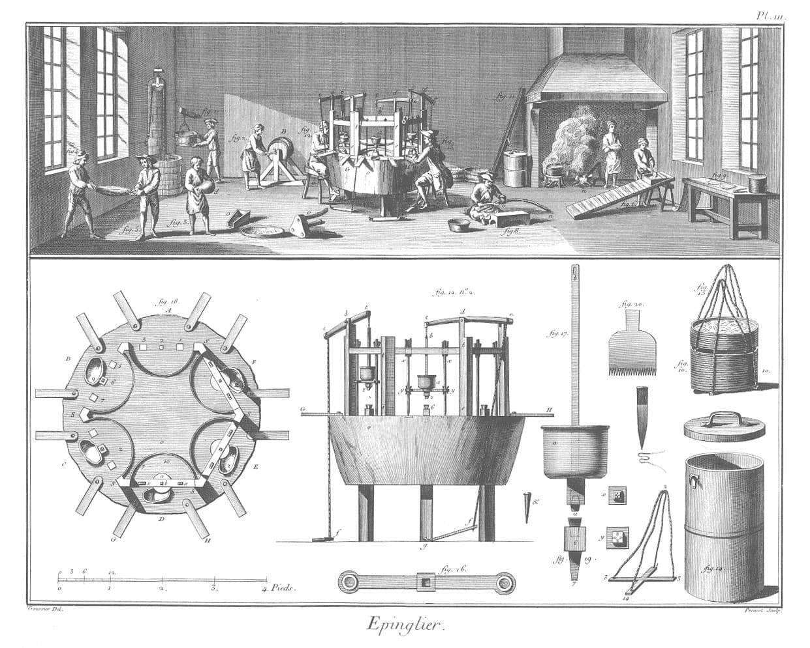

<!-- This line determines the chapter heading. -->
\renewcommand{\chaptername}{Adam Smith on the Division of Labor}

<!-- In the line below, first pair of brackets determines the chapter name in the ToC. The second determines the chapter name in the page header. The pair of curly braces determine the subtitle beneath the chapter heading. -->
\chapter[Adam Smith on the Division of Labor][Adam Smith on the Division of Labor]{\Large\normalfont Extracts from Book I, Chapters I-III of \textit{An Inquiry into the Nature and Causes of the Wealth of Nations (1776)\footnote{Public domain. Source text from \href{https://www.gutenberg.org/ebooks/3300}{Project Gutenberg}.}}}

<!-- The chapterprecistoc determines the subtitle as it will appear in the ToC -->
\chapterprecistoc{Extracts from Book I, Chapters I-III of \textit{An Inquiry into the Nature and Causes of the Wealth of Nations} (1776)}

<!-- We can refer to this label elsewhere in the dissertation to point to this chapter. -->
\label{chapter1}

<!-- Here is an opening quote. Note that Pandoc cannot process citations (and other Markdown syntax) within LaTeX commands. To make it appear in the bibliography, Schumpeter's book is included in the nocite YAML setting of the front matter. -->
\begin{quotation}
``[N]obody, either before or after A. Smith, ever thought of putting such a burden upon division of labor. With A. Smith it is practically the only factor in economic progress.''
\sourceatright{(Schumpeter 1954, 182)}
\end{quotation}

## The example of the pin factory

The greatest improvements in the productive powers of labour, and the greater part of the skill, dexterity, and judgment, with which it is anywhere directed, or applied, seem to have been the effects of the division of labour. The effects of the division of labour, in the general business of society, will be more easily understood, by considering in what manner it operates in some particular manufactures. It is commonly supposed to be carried furthest in some very trifling ones; not perhaps that it really is carried further in them than in others of more importance: but in those trifling manufactures which are destined to supply the small wants of but a small number of people, the whole number of workmen must necessarily be small; and those employed in every different branch of the work can often be collected into the same workhouse, and placed at once under the view of the spectator.

In those great manufactures, on the contrary, which are destined to supply the great wants of the great body of the people, every different branch of the work employs so great a number of workmen, that it is impossible to collect them all into the same workhouse. We can seldom see more, at one time, than those employed in one single branch. Though in such manufactures, therefore, the work may really be divided into a much greater number of parts, than in those of a more trifling nature, the division is not near so obvious, and has accordingly been much less observed.

{width=400px}

To take an example, therefore, from a very trifling manufacture, but one in which the division of labour has been very often taken notice of, the trade of a pin-maker: a workman not educated to this business (which the division of labour has rendered a distinct trade), nor acquainted with the use of the machinery employed in it (to the invention of which the same division of labour has probably given occasion), could scarce, perhaps, with his utmost industry, make one pin in a day, and certainly could not make twenty. But in the way in which this business is now carried on, not only the whole work is a peculiar trade, but it is divided into a number of branches, of which the greater part are likewise peculiar trades. One man draws out the wire; another straights it; a third cuts it; a fourth points it; a fifth grinds it at the top for receiving the head; to make the head requires two or three distinct operations; to put it on is a peculiar business; to whiten the pins is another; it is even a trade by itself to put them into the paper; and the important business of making a pin is, in this manner, divided into about eighteen distinct operations, which, in some manufactories, are all performed by distinct hands, though in others the same man will sometimes perform two or three of them. I have seen a small manufactory of this kind, where ten men only were employed, and where some of them consequently performed two or three distinct operations. But though they were very poor, and therefore but indifferently accommodated with the necessary machinery, they could, when they exerted themselves, make among them about twelve pounds of pins in a day. There are in a pound upwards of four thousand pins of a middling size. Those ten persons, therefore, could make among them upwards of forty-eight thousand pins in a day. Each person, therefore, making a tenth part of forty-eight thousand pins, might be considered as making four thousand eight hundred pins in a day. But if they had all wrought separately and independently, and without any of them having been educated to this peculiar business, they certainly could not each of them have made twenty, perhaps not one pin in a day; that is, certainly, not the two hundred and fortieth, perhaps not the four thousand eight hundredth, part of what they are at present capable of performing, in consequence of a proper division and combination of their different operations.

In every other art and manufacture, the effects of the division of labour are similar to what they are in this very trifling one, though, in many of them, the labour can neither be so much subdivided, nor reduced to so great a simplicity of operation. The division of labour, however, so far as it can be introduced, occasions, in every art, a proportionable increase of the productive powers of labour. The separation of different trades and employments from one another, seems to have taken place in consequence of this advantage. This separation, too, is generally carried furthest in those countries which enjoy the highest degree of industry and improvement; what is the work of one man, in a rude state of society, being generally that of several in an improved one. In every improved society, the farmer is generally nothing but a farmer; the manufacturer, nothing but a manufacturer. The labour, too, which is necessary to produce any one complete manufacture, is almost always divided among a great number of hands. How many different trades are employed in each branch of the linen and woollen manufactures, from the growers of the flax and the wool, to the bleachers and smoothers of the linen, or to the dyers and dressers of the cloth! The nature of agriculture, indeed, does not admit of so many subdivisions of labour, nor of so complete a separation of one business from another, as manufactures. It is impossible to separate so entirely the business of the grazier from that of the corn-farmer, as the trade of the carpenter is commonly separated from that of the smith. The spinner is almost always a distinct person from the weaver; but the ploughman, the harrower, the sower of the seed, and the reaper of the corn, are often the same. The occasions for those different sorts of labour returning with the different seasons of the year, it is impossible that one man should be constantly employed in any one of them. This impossibility of making so complete and entire a separation of all the different branches of labour employed in agriculture, is perhaps the reason why the improvement of the productive powers of labour, in this art, does not always keep pace with their improvement in manufactures. The most opulent nations, indeed, generally excel all their neighbours in agriculture as well as in manufactures; but they are commonly more distinguished by their superiority in the latter than in the former. Their lands are in general better cultivated, and having more labour and expense bestowed upon them, produce more in proportion to the extent and natural fertility of the ground. But this superiority of produce is seldom much more than in proportion to the superiority of labour and expense. In agriculture, the labour of the rich country is not always much more productive than that of the poor; or, at least, it is never so much more productive, as it commonly is in manufactures. The corn of the rich country, therefore, will not always, in the same degree of goodness, come cheaper to market than that of the poor. The corn of Poland, in the same degree of goodness, is as cheap as that of France, notwithstanding the superior opulence and improvement of the latter country. The corn of France is, in the corn-provinces, fully as good, and in most years nearly about the same price with the corn of England, though, in opulence and improvement, France is perhaps inferior to England. The corn-lands of England, however, are better cultivated than those of France, and the corn-lands of France are said to be much better cultivated than those of Poland. But though the poor country, notwithstanding the inferiority of its cultivation, can, in some measure, rival the rich in the cheapness and goodness of its corn, it can pretend to no such competition in its manufactures, at least if those manufactures suit the soil, climate, and situation, of the rich country. The silks of France are better and cheaper than those of England, because the silk manufacture, at least under the present high duties upon the importation of raw silk, does not so well suit the climate of England as that of France. But the hardware and the coarse woollens of England are beyond all comparison superior to those of France, and much cheaper, too, in the same degree of goodness. In Poland there are said to be scarce any manufactures of any kind, a few of those coarser household manufactures excepted, without which no country can well subsist.

## How the division of labor increases productivity

This great increase in the quantity of work, which, in consequence of the division of labour, the same number of people are capable of performing, is owing to three different circumstances; first, to the increase of dexterity in every particular workman; secondly, to the saving of the time which is commonly lost in passing from one species of work to another; and, lastly, to the invention of a great number of machines which facilitate and abridge labour, and enable one man to do the work of many. . . .

| Cause of increased productivity                                                                                             | Example                                                                                                                                                                                                                |
| --------------------------------------------------------------------------------------------------------------------------- | ---------------------------------------------------------------------------------------------------------------------------------------------------------------------------------------------------------------------- |
| **Dexterity of the workman**: Specialization in one simple task greatly improves skill and speed.                           | Nail-making: an untrained smith makes 200–300 nails/day (poor quality); a part-time nailer makes 800–1,000; a trained boy nailer can make 2,300+. In even simpler trades (pins, buttons), dexterity gains are greater. |
| **Saving of time**: Workers avoid the loss of time from switching between tasks, tools, and workplaces.                     | A country weaver who also farms wastes time moving between loom and field; even in one workshop, frequent switching leads to “sauntering” and poor focus.                                                              |
| **Use of machinery**: Division of labour directs attention to narrow tasks, encouraging invention of machines to ease them. | Early steam engine: a boy tied the valve handle with a string so it worked automatically, freeing his hands. Many machines were devised by workmen themselves seeking easier methods.                                  |

Table: Sources of productivity gains from the division of labor according to Adam Smith, Chapter I of Book I of the *Wealth of Nations*.

All the improvements in machinery, however, have by no means been the inventions of those who had occasion to use the machines. Many improvements have been made by the ingenuity of the makers of the machines, when to make them became the business of a peculiar trade; and some by that of those who are called philosophers, or men of speculation, whose trade it is not to do any thing, but to observe every thing, and who, upon that account, are often capable of combining together the powers of the most distant and dissimilar objects in the progress of society, philosophy or speculation becomes, like every other employment, the principal or sole trade and occupation of a particular class of citizens. Like every other employment, too, it is subdivided into a great number of different branches, each of which affords occupation to a peculiar tribe or class of philosophers; and this subdivision of employment in philosophy, as well as in every other business, improves dexterity, and saves time. Each individual becomes more expert in his own peculiar branch, more work is done upon the whole, and the quantity of science is considerably increased by it.

## The multiplication of the arts

It is the great multiplication of the productions of all the different arts, in consequence of the division of labour, which occasions, in a well-governed society, that universal opulence which extends itself to the lowest ranks of the people. Every workman has a great quantity of his own work to dispose of beyond what he himself has occasion for; and every other workman being exactly in the same situation, he is enabled to exchange a great quantity of his own goods for a great quantity or, what comes to the same thing, for the price of a great quantity of theirs. He supplies them abundantly with what they have occasion for, and they accommodate him as amply with what he has occasion for, and a general plenty diffuses itself through all the different ranks of the society.

Observe the accommodation of the most common artificer or daylabourer in a civilized and thriving country, and you will perceive that the number of people, of whose industry a part, though but a small part, has been employed in procuring him this accommodation, exceeds all computation. The woollen coat, for example, which covers the day-labourer, as coarse and rough as it may appear, is the produce of the joint labour of a great multitude of workmen. The shepherd, the sorter of the wool, the wool-comber or carder, the dyer, the scribbler, the spinner, the weaver, the fuller, the dresser, with many others, must all join their different arts in order to complete even this homely production. How many merchants and carriers, besides, must have been employed in transporting the materials from some of those workmen to others who often live in a very distant part of the country? How much commerce and navigation in particular, how many ship-builders, sailors, sail-makers, rope-makers, must have been employed in order to bring together the different drugs made use of by the dyer, which often come from the remotest corners of the world? What a variety of labour, too, is necessary in order to produce the tools of the meanest of those workmen! To say nothing of such complicated machines as the ship of the sailor, the mill of the fuller, or even the loom of the weaver, let us consider only what a variety of labour is requisite in order to form that very simple machine, the shears with which the shepherd clips the wool. The miner, the builder of the furnace for smelting the ore, the feller of the timber, the burner of the charcoal to be made use of in the smelting-house, the brickmaker, the bricklayer, the workmen who attend the furnace, the millwright, the forger, the smith, must all of them join their different arts in order to produce them. Were we to examine, in the same manner, all the different parts of his dress and household furniture, the coarse linen shirt which he wears next his skin, the shoes which cover his feet, the bed which he lies on, and all the different parts which compose it, the kitchen-grate at which he prepares his victuals, the coals which he makes use of for that purpose, dug from the bowels of the earth, and brought to him, perhaps, by a long sea and a long land-carriage, all the other utensils of his kitchen, all the furniture of his table, the knives and forks, the earthen or pewter plates upon which he serves up and divides his victuals, the different hands employed in preparing his bread and his beer, the glass window which lets in the heat and the light, and keeps out the wind and the rain, with all the knowledge and art requisite for preparing that beautiful and happy invention, without which these northern parts of the world could scarce have afforded a very comfortable habitation, together with the tools of all the different workmen employed in producing those different conveniencies; if we examine, I say, all these things, and consider what a variety of labour is employed about each of them, we shall be sensible that, without the assistance and co-operation of many thousands, the very meanest person in a civilized country could not be provided, even according to, what we very falsely imagine, the easy and simple manner in which he is commonly accommodated. Compared, indeed, with the more extravagant luxury of the great, his accommodation must no doubt appear extremely simple and easy; and yet it may be true, perhaps, that the accommodation of an European prince does not always so much exceed that of an industrious and frugal peasant, as the accommodation of the latter exceeds that of many an African king, the absolute masters of the lives and liberties of ten thousand naked savages. 

## The difference of talents

. . . The difference of natural talents in different men, is, in reality, much less than we are aware of; and the very different genius which appears to distinguish men of different professions, when grown up to maturity, is not upon many occasions so much the cause, as the effect of the division of labour. The difference between the most dissimilar characters, between a philosopher and a common street porter, for example, seems to arise not so much from nature, as from habit, custom, and education. When they came in to the world, and for the first six or eight years of their existence, they were, perhaps, very much alike, and neither their parents nor play-fellows could perceive any remarkable difference. About that age, or soon after, they come to be employed in very different occupations. The difference of talents comes then to be taken notice of, and widens by degrees, till at last the vanity of the philosopher is willing to acknowledge scarce any resemblance. But without the disposition to truck, barter, and exchange, every man must have procured to himself every necessary and conveniency of life which he wanted. All must have had the same duties to perform, and the same work to do, and there could have been no such difference of employment as could alone give occasion to any great difference of talents.

As it is this disposition which forms that difference of talents, so remarkable among men of different professions, so it is this same disposition which renders that difference useful. Many tribes of animals, acknowledged to be all of the same species, derive from nature a much more remarkable distinction of genius, than what, antecedent to custom and education, appears to take place among men. By nature a philosopher is not in genius and disposition half so different from a street porter, as a mastiff is from a grey-hound, or a grey-hound from a spaniel, or this last from a shepherd's dog. Those different tribes of animals, however, though all of the same species are of scarce any use to one another. The strength of the mastiff is not in the least supported either by the swiftness of the greyhound, or by the sagacity of the spaniel, or by the docility of the shepherd's dog. The effects of those different geniuses and talents, for want of the power or disposition to barter and exchange, cannot be brought into a common stock, and do not in the least contribute to the better accommodation and conveniency of the species. Each animal is still obliged to support and defend itself, separately and independently, and derives no sort of advantage from that variety of talents with which nature has distinguished its fellows. Among men, on the contrary, the most dissimilar geniuses are of use to one another; the different produces of their respective talents, by the general disposition to truck, barter, and exchange, being brought, as it were, into a common stock, where every man may purchase whatever part of the produce of other men's talents he has occasion for.

## The extent of the market

As it is the power of exchanging that gives occasion to the division of labour, so the extent of this division must always be limited by the extent of that power, or, in other words, by the extent of the market. When the market is very small, no person can have any encouragement to dedicate himself entirely to one employment, for want of the power to exchange all that surplus part of the produce of his own labour, which is over and above his own consumption, for such parts of the produce of other men's labour as he has occasion for.

There are some sorts of industry, even of the lowest kind, which can be carried on nowhere but in a great town. A porter, for example, can find employment and subsistence in no other place. A village is by much too narrow a sphere for him; even an ordinary market-town is scarce large enough to afford him constant occupation. In the lone houses and very small villages which are scattered about in so desert a country as the highlands of Scotland, every farmer must be butcher, baker, and brewer, for his own family. In such situations we can scarce expect to find even a smith, a carpenter, or a mason, within less than twenty miles of another of the same trade. The scattered families that live at eight or ten miles distance from the nearest of them, must learn to perform themselves a great number of little pieces of work, for which, in more populous countries, they would call in the assistance of those workmen. Country workmen are almost everywhere obliged to apply themselves to all the different branches of industry that have so much affinity to one another as to be employed about the same sort of materials. A country carpenter deals in every sort of work that is made of wood; a country smith in every sort of work that is made of iron. The former is not only a carpenter, but a joiner, a cabinet-maker, and even a carver in wood, as well as a wheel-wright, a plough-wright, a cart and waggon-maker. The employments of the latter are still more various. It is impossible there should be such a trade as even that of a nailer in the remote and inland parts of the highlands of Scotland. Such a workman at the rate of a thousand nails a-day, and three hundred working days in the year, will make three hundred thousand nails in the year. But in such a situation it would be impossible to dispose of one thousand, that is, of one day's work in the year. As by means of water-carriage, a more extensive market is opened to every sort of industry than what land-carriage alone can afford it, so it is upon the sea-coast, and along the banks of navigable rivers, that industry of every kind naturally begins to subdivide and improve itself, and it is frequently not till a long time after that those improvements extend themselves to the inland parts of the country. A broad-wheeled waggon, attended by two men, and drawn by eight horses, in about six weeks time, carries and brings back between London and Edinburgh near four ton weight of goods. In about the same time a ship navigated by six or eight men, and sailing between the ports of London and Leith, frequently carries and brings back two hundred ton weight of goods. Six or eight men, therefore, by the help of water-carriage, can carry and bring back, in the same time, the same quantity of goods between London and Edinburgh as fifty broad-wheeled waggons, attended by a hundred men, and drawn by four hundred horses. Upon two hundred tons of goods, therefore, carried by the cheapest land-carriage from London to Edinburgh, there must be charged the maintenance of a hundred men for three weeks, and both the maintenance and what is nearly equal to maintenance the wear and tear of four hundred horses, as well as of fifty great waggons. Whereas, upon the same quantity of goods carried by water, there is to be charged only the maintenance of six or eight men, and the wear and tear of a ship of two hundred tons burthen, together with the value of the superior risk, or the difference of the insurance between land and water-carriage. Were there no other communication between those two places, therefore, but by land-carriage, as no goods could be transported from the one to the other, except such whose price was very considerable in proportion to their weight, they could carry on but a small part of that commerce which at present subsists between them, and consequently could give but a small part of that encouragement which they at present mutually afford to each other's industry. There could be little or no commerce of any kind between the distant parts of the world. What goods could bear the expense of land-carriage between London and Calcutta? Or if there were any so precious as to be able to support this expense, with what safety could they be transported through the territories of so many barbarous nations? Those two cities, however, at present carry on a very considerable commerce with each other, and by mutually affording a market, give a good deal of encouragement to each other's industry. . . .