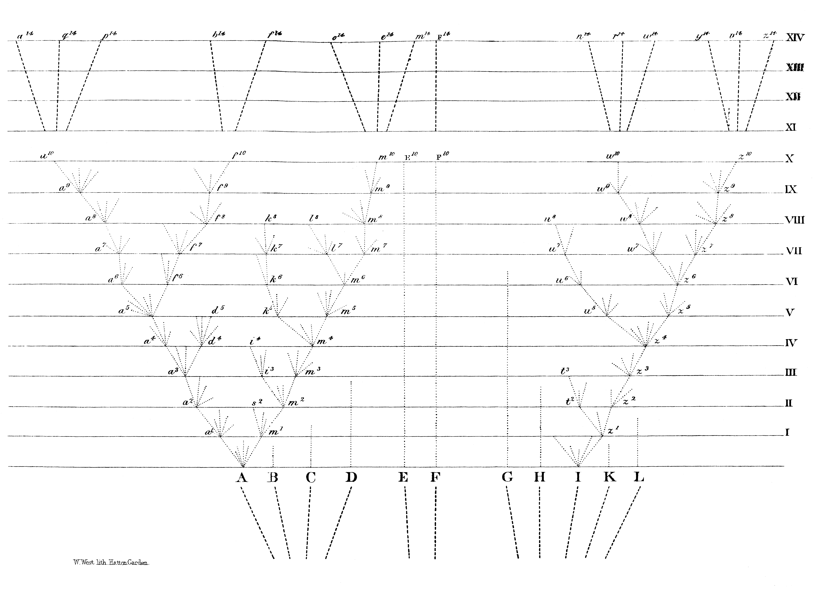

\renewcommand{\chaptername}{Charles Darwin on the formation of species}
\chapter[Charles Darwin on the formation of species][Charles Darwin on the formation of species]{\Large\normalfont Extract from Chapter IV of \textit{On the Origin of Species by Means of Natural Selection} 1859\footnote{Public domain. Source text from \href{https://www.gutenberg.org/ebooks/22764}{Project Gutenberg}.}}
\label{chapter2}
\chapterprecistoc{Extract from Chapter IV of \textit{On the Origin of Species by Means of Natural Selection} 1859}

\begin{quotation}
``[I]l n'est aucune autre qualité aussi universelle, dans ce tableau des choses, que la diversité et la variété.''
\sourceatright{(Montaigne, \textit{Essais}, "De l'expérience")}
\end{quotation}

. . .

*Divergence of Character*. --- The principle, which I have designated by this term, is of high importance on my theory, and explains, as I believe, several important facts. In the first place, varieties, even strongly-marked ones, though having somewhat of the character of species--—as is shown by the hopeless doubts in many cases how to rank them--—yet certainly differ from each other far less than do good and distinct species. Nevertheless, according to my view, varieties are species in the process of formation, or are, as I have called them, incipient species. How, then, does the lesser difference between varieties become augmented into the greater difference between species? That this does habitually happen, we must infer from most of the innumerable species throughout nature presenting well-marked differences; whereas varieties, the supposed prototypes and parents of future well-marked species, present slight and ill-defined differences. Mere chance, as we may call it, might cause one variety to differ in some character from its parents, and the offspring of this variety again to differ from its parent in the very same character and in a greater degree; but this alone would never account for so habitual and large an amount of difference as that between varieties of the same species and species of the same genus.

As has always been my practice, let us seek light on this head from our domestic productions. We shall here find something analogous. A fancier is struck by a pigeon having a slightly shorter beak; another fancier is struck by a pigeon having a rather longer beak; and on the acknowledged principle that "fanciers do not and will not admire a medium standard, but like extremes," they both go on (as has actually occurred with tumbler-pigeons) choosing and breeding from birds with longer and longer beaks, or with shorter and shorter beaks. Again, we may suppose that at an early period one man preferred swifter horses; another stronger and more bulky horses. The early differences would be very slight; in the course of time, from the continued selection of swifter horses by some breeders, and of stronger ones by others, the differences would become greater, and would be noted as forming two sub-breeds; finally, after the lapse of centuries, the sub-breeds would become converted into two well-established and distinct breeds. As the differences slowly become greater, the inferior animals with intermediate characters, being neither very swift nor very strong, will have been neglected, and will have tended to disappear. Here, then, we see in man's productions the action of what may be called the principle of divergence, causing differences, at first barely appreciable, steadily to increase, and the breeds to diverge in character both from each other and from their common parent.

But how, it may be asked, can any analogous principle apply in nature? I believe it can and does apply most efficiently, from the simple circumstance that the more diversified the descendants from any one species become in structure, constitution, and habits, by so much will they be better enabled to seize on many and widely diversified places in the polity of nature, and so be enabled to increase in numbers.

We can clearly see this in the case of animals with simple habits. Take the case of a carnivorous quadruped, of which the number that can be supported in any country has long ago arrived at its full average. If its natural powers of increase be allowed to act, it can succeed in increasing (the country not undergoing any change in its conditions) only by its varying descendants seizing on places at present occupied by other animals: some of them, for instance, being enabled to feed on new kinds of prey, either dead or alive; some inhabiting new stations, climbing trees, frequenting water, and some perhaps becoming less carnivorous. The more diversified in habits and structure the descendants of our carnivorous animal became, the more places they would be enabled to occupy. What applies to one animal will apply throughout all time to all animals—that is, if they vary—for otherwise natural selection can do nothing. So it will be with plants. It has been experimentally proved, that if a plot of ground be sown with one species of grass, and a similar plot be sown with several distinct genera of grasses, a greater number of plants and a greater weight of dry herbage can thus be raised. The same has been found to hold good when first one variety and then several mixed varieties of wheat have been sown on equal spaces of ground. Hence, if any one species of grass were to go on varying, and those varieties were continually selected which differed from each other in at all the same manner as distinct species and genera of grasses differ from each other, a greater number of individual plants of this species of grass, including its modified descendants, would succeed in living on the same piece of ground. And we well know that each species and each variety of grass is annually sowing almost countless seeds; and thus, as it may be said, is striving its utmost to increase its numbers. [114]Consequently, I cannot doubt that in the course of many thousands of generations, the most distinct varieties of any one species of grass would always have the best chance of succeeding and of increasing in numbers, and thus of supplanting the less distinct varieties; and varieties, when rendered very distinct from each other, take the rank of species.

The truth of the principle, that the greatest amount of life can be supported by great diversification of structure, is seen under many natural circumstances. In an extremely small area, especially if freely open to immigration, and where the contest between individual and individual must be severe, we always find great diversity in its inhabitants. For instance, I found that a piece of turf, three feet by four in size, which had been exposed for many years to exactly the same conditions, supported twenty species of plants, and these belonged to eighteen genera and to eight orders, which shows how much these plants differed from each other. So it is with the plants and insects on small and uniform islets; and so in small ponds of fresh water. Farmers find that they can raise most food by a rotation of plants belonging to the most different orders: nature follows what may be called a simultaneous rotation. Most of the animals and plants which live close round any small piece of ground, could live on it (supposing it not to be in any way peculiar in its nature), and may be said to be striving to the utmost to live there; but, it is seen, that where they come into the closest competition with each other, the advantages of diversification of structure, with the accompanying differences of habit and constitution, determine that the inhabitants, which thus jostle each other most closely, shall, as a general rule, belong to what we call different genera and orders.

The same principle is seen in the naturalisation of plants through man's agency in foreign lands. It might have been expected that the plants which have succeeded in becoming naturalised in any land would generally have been closely allied to the indigenes; for these are commonly looked at as specially created and adapted for their own country. It might, also, perhaps have been expected that naturalised plants would have belonged to a few groups more especially adapted to certain stations in their new homes. But the case is very different; and Alph. De Candolle has well remarked in his great and admirable work, that floras gain by naturalisation, proportionally with the number of the native genera and species, far more in new genera than in new species. To give a single instance: in the last edition of Dr. Asa Gray's 'Manual of the Flora of the Northern United States,' 260 naturalised plants are enumerated, and these belong to 162 genera. We thus see that these naturalised plants are of a highly diversified nature. They differ, moreover, to a large extent from the indigenes, for out of the 162 genera, no less than 100 genera are not there indigenous, and thus a large proportional addition is made to the genera of these States.

By considering the nature of the plants or animals which have struggled successfully with the indigenes of any country, and have there become naturalised, we may gain some crude idea in what manner some of the natives would have to be modified, in order to gain an advantage over the other natives; and we may at least safely infer that diversification of structure, amounting to new generic differences, would be profitable to them.

The advantage of diversification in the inhabitants of the same region is, in fact, the same as that of the physiological division of labour in the organs of the same individual body—a subject so well elucidated by Milne Edwards. No physiologist doubts that a stomach adapted to digest vegetable matter alone, or flesh alone, draws most nutriment from these substances. So in the general economy of any land, the more widely and perfectly the animals and plants are diversified for different habits of life, so will a greater number of individuals be capable of there supporting themselves. A set of animals, with their organisation but little diversified, could hardly compete with a set more perfectly diversified in structure. It may be doubted, for instance, whether the Australian marsupials, which are divided into groups differing but little from each other, and feebly representing, as Mr. Waterhouse and others have remarked, our carnivorous, ruminant, and rodent mammals, could successfully compete with these well-pronounced orders. In the Australian mammals, we see the process of diversification in an early and incomplete stage of development.

After the foregoing discussion, which ought to have been much amplified, we may, I think, assume that the modified descendants of any one species will succeed by so much the better as they become more diversified in structure, and are thus enabled to encroach on places occupied by other beings. Now let us see how this principle of benefit being derived from divergence of character, combined with the principles of natural selection and of extinction, will tend to act.

The accompanying diagram will aid us in understanding this rather perplexing subject. Let $A$ to $L$ represent the species of a genus large in its own country; these species are supposed to resemble each other in unequal degrees, as is so generally the case in nature, and as is represented in the diagram by the letters standing at unequal distances. I have said a large genus, because we have seen in the second chapter, that on an average more of the species of large genera vary than of small genera; and the varying species of the large genera present a greater number of varieties. We have, also, seen that the species, which are the commonest and the most widely-diffused, vary more than rare species with restricted ranges. Let $(A)$ be a common, widely-diffused, and varying species, belonging to a genus large in its own country. The little fan of diverging dotted lines of unequal lengths proceeding from $(A)$, may represent its varying offspring. The variations are supposed to be extremely slight, but of the most diversified nature; they are not supposed all to appear simultaneously, but often after long intervals of time; nor are they all supposed to endure for equal periods. Only those variations which are in some way profitable will be preserved or naturally selected. And here the importance of the principle of benefit being derived from divergence of character comes in; for this will generally lead to the most different or divergent variations (represented by the outer dotted lines) being preserved and accumulated by natural selection. When a dotted line reaches one of the horizontal lines, and is there marked by a small numbered letter, a sufficient amount of variation is supposed to have been accumulated to have formed a fairly well-marked variety, such as would be thought worthy of record in a systematic work.

The intervals between the horizontal lines in the diagram, may represent each a thousand generations; but it would have been better if each had represented ten thousand generations. After a thousand generations, species $(A)$ is supposed to have produced two fairly well-marked varieties, namely a1 and m1. These two varieties will generally continue to be exposed to the same conditions which made their parents variable, and the tendency to variability is in itself hereditary, consequently they will tend to vary, and generally to vary in nearly the same manner as their parents varied. Moreover, these two varieties, being only slightly modified forms, will tend to inherit those advantages which made their parent $(A)$ more numerous than most of the other inhabitants of the same country; they will likewise partake of those more general advantages which made the genus to which the parent-species belonged, a large genus in its own country. And these circumstances we know to be favourable to the production of new varieties.

If, then, these two varieties be variable, the most divergent of their variations will generally be preserved during the next thousand generations. And after this interval, variety $a^1$ is supposed in the diagram to have produced variety $a^2$, which will, owing to the principle of divergence, differ more from $(A)$ than did variety $a^1$. Variety $m^1$ is supposed to have produced two varieties, namely $m^2$ and $s^2$, differing from each other, and more considerably from their common parent $(A)$. We may continue the process by similar steps for any length of time; some of the varieties, after each thousand generations, producing only a single variety, but in a more and more modified condition, some producing two or three varieties, and some failing to produce any. Thus the varieties or modified descendants, proceeding from the common parent $(A)$, will generally go on increasing in number and diverging in character. In the diagram the process is represented up to the ten-thousandth generation, and under a condensed and simplified form up to the fourteen-thousandth generation.

But I must here remark that I do not suppose that the process ever goes on so regularly as is represented in the diagram, though in itself made somewhat irregular. I am far from thinking that the most divergent varieties will invariably prevail and multiply: a medium form may often long endure, and may or may not produce more than one modified descendant; for natural selection will always act according to the nature of the places which are either unoccupied or not perfectly occupied by other beings; and this will depend on infinitely complex relations. But as a general rule, the more diversified in structure the descendants from any one species can be rendered, the more places they will be enabled to seize on, and the more their modified progeny will be increased. In our diagram the line of succession is broken at regular intervals by small numbered letters marking the successive forms which have become sufficiently distinct to be recorded as varieties. But these breaks are imaginary, and might have been inserted anywhere, after intervals long enough to have allowed the accumulation of a considerable amount of divergent variation. . . .