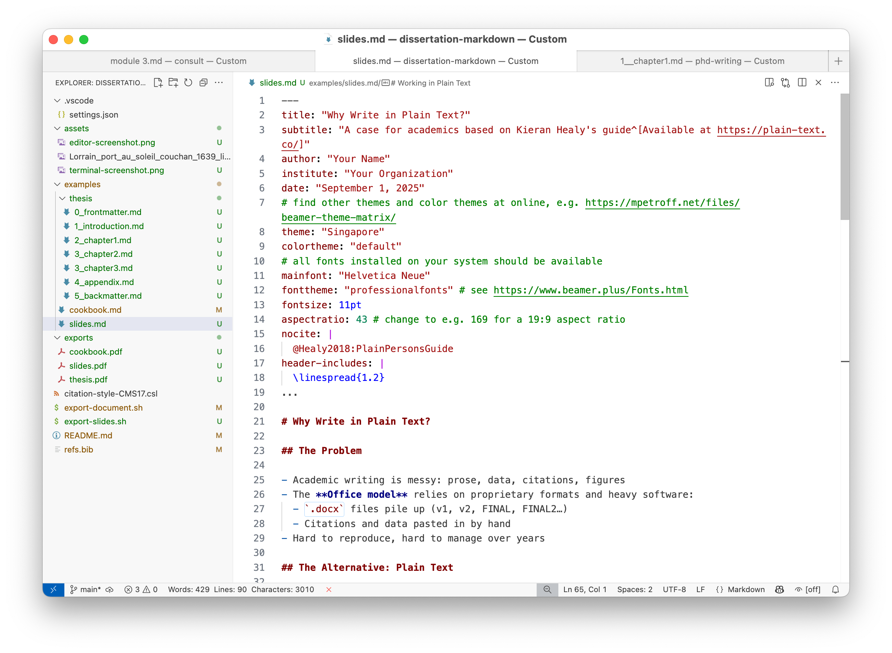

\centering{(not to mention the nerdy aesthetic)}

{width=320px}

# Practices and tools

### Good Practices

- Keep a record (scripts, notes, datasets in plain text)
- Use **version control** (Git) instead of endless “Final.docx”
- **Back up** automatically (e.g. GitHub + offsite)

### Tools of the Trade

- **Text editors** (VS Code, Emacs, Sublime, etc.)  
- **Markdown** for formatting, citations, cross-references  
- **Pandoc** to convert Markdown to PAF/Word/HTML  
- **R + RMarkdown** for integrated analysis & writing  

# The Takeaway

### Plain text = control over your research workflow

- Scales from a single paper to an entire dissertation
- Frees you from software lock-in
- Makes your work reproducible for collaborators, reviewers, and your future self

# Further reading

### More on Beamer + Pandoc

- Integrate some examples from the [cookbook](./cookbook.md) into the slides
- About the front matter, refer to the [typesetting section](../README.md#typesetting-your-documents) of the README
- Get familiar [Pandoc guide](https://pandoc.org/MANUAL.html#slide-shows) on slide shows with Beamer
- Change the combination of [beamer themes and colorthemes](https://mpetroff.net/files/beamer-theme-matrix/)
- Dive into the [official](https://ctan.org/pkg/beamer) or [unofficial](https://www.beamer.plus/home.html) manuals for the beamer class

## References

